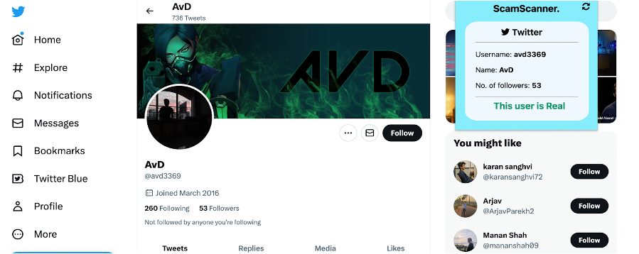
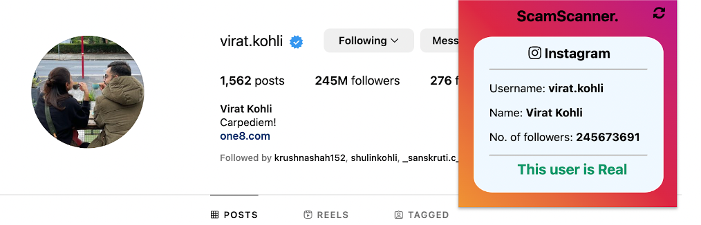
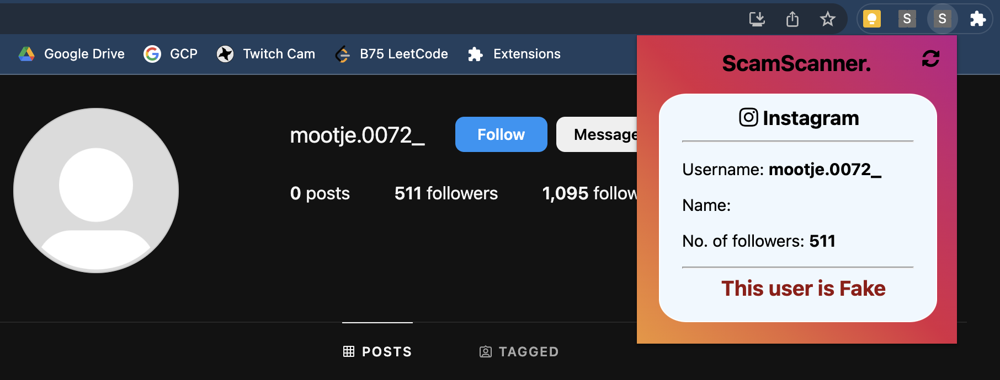

# Scam Scanner

Scam Scanner is a browser extension made to detect fake Instagram and Twitter accounts. 
Currently only supporting chromium-based browsers.

## Folders
The code is split across 4 folders:

1. **Data**: Contains the datasets for the models.
2. **Extension**: Contains the code of the browser extension.
3. **Models**: Contains the files used to create and save the trained models.
4. **Server**: Contains a Flask server which is used to generate predictions and is used with the extension.

## Models
The models have been trained on the Random Forest Algorithm. We have tested 5 models using cross-validation. They are:

1. Random Forest Classifier
2. Gradient Boosting Classifier
3. Logistic Regression Classifier
4. Support Vector Classifier
5. Gaussian Naive Bayes Classifier

The Random Forest model gave us the best results so we went ahead with that.
The trained models have been stored as pickle files and can be found [here](https://drive.google.com/drive/folders/18Fd__baOE8ZyId5DZiovFITkZJqNaKjF?usp=sharing).

## Setup

In order to set up the project:

1. Download the models from the [Google Drive link](https://drive.google.com/drive/folders/18Fd__baOE8ZyId5DZiovFITkZJqNaKjF?usp=sharing).
2. Put the downloaded pickle files into the Server folder.
3. Load the browser extension:

    - On Google Chrome:
        1. Click on the extension button
        2. Enable Developer mode from the top right corner.
        3. Click on "Load Unpacked"
        4. Select the "Extension" folder.

4. Set Twitter API keys:
   - Get Twitter API keys from [here](https://developer.twitter.com).
   - Put them into the env file as shown in the env_example.txt file.

5. Now you can start the server by running the app.py file.
6. Once the server is running, you can open an Instagram or Twitter account and click on the Chrome extension to test whether it is a fake account or not.

## Results
<ul>
<b><li>Real Twitter Account:</l1>

 

<li>Fake Twitter Account:</li>

 

<li>Real Instagram Account:</li>

 

<li>Fake Instagram Account:</li>

 

</b>
</ul>
